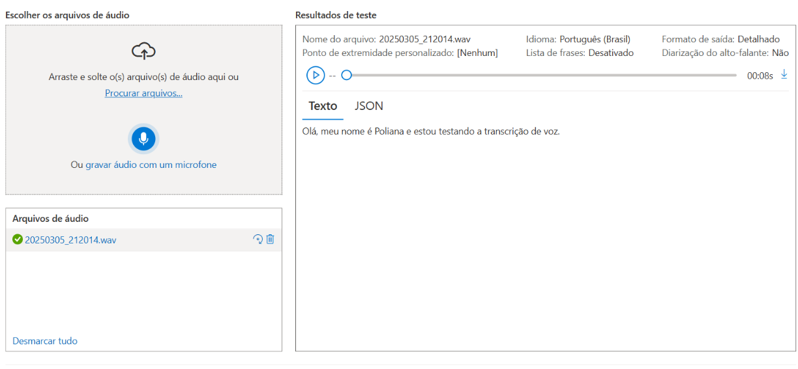
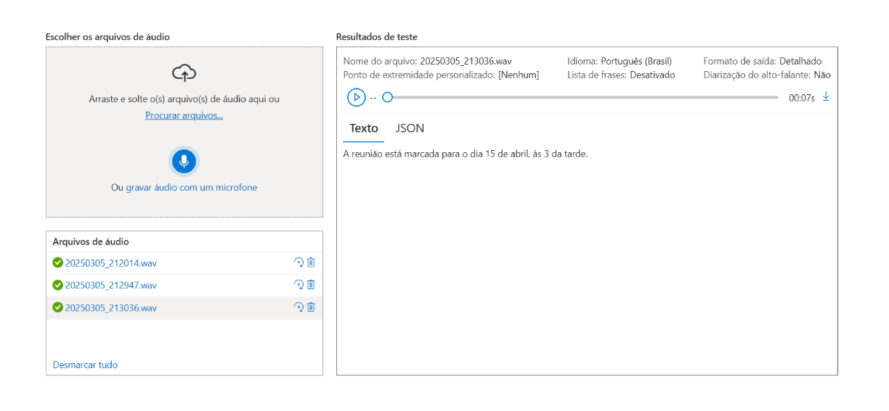
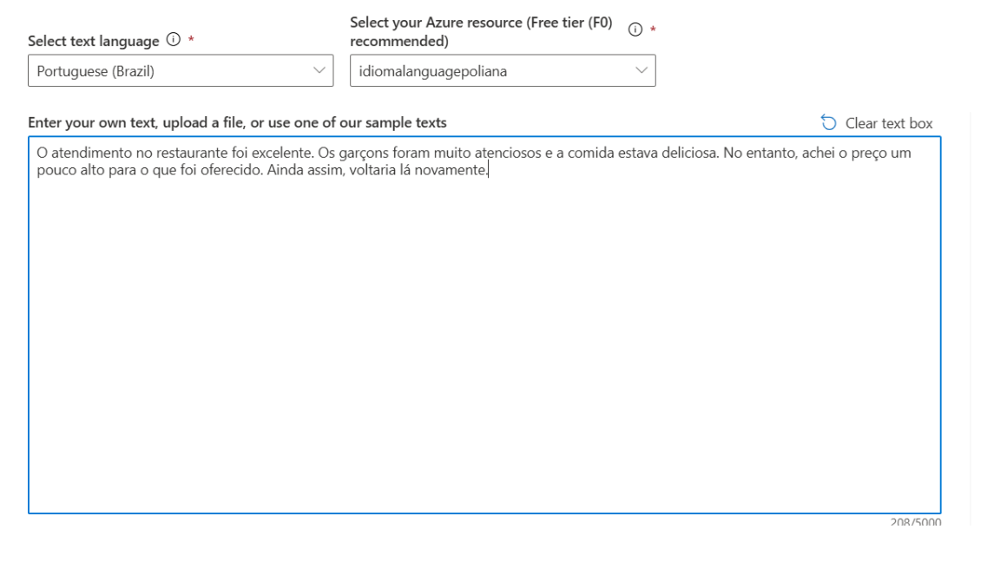

# Transcrição de Áudio com Azure AI Speech

Este repositório mostra meu teste com a ferramenta de transcrição de fala para texto da plataforma Azure AI Speech.

## 🛠️ Etapas do processo

1. Acesse o **Language Studio** do Azure.
2. Criei um recurso de **Serviço de Fala (Speech Service)**.
3. Usei a aba de **Speech to Text** para testar a transcrição automática.
4. Falei algumas frases ou fiz o upload de um áudio com as sentenças.
5. O sistema analisou e gerou a transcrição em texto.

---

## 📝 Frases usadas nos testes

As frases foram salvas no arquivo `inputs/sentencas.txt`.

##  Prints do processo

Aqui vão alguns prints mostrando como foi o processo:

📌 Interface do Speech to Text com o resultado da transcrição:  

📌 Outro exemplo de frase com o resultado da transcrição:  

---

# Análise de sentimentos com Language Studio

##  Prints do processo

Aqui vão alguns prints mostrando como foi o processo:

📌 Interface do Language Studio com a frase para teste:  

📌 Encontrei o seguinte erro no processo de execução:  

---

## Dificuldade no uso do Language Studio

Durante o laboratório, tive dificuldades ao tentar usar o Language Studio com o recurso de análise de sentimentos. Mesmo após criar corretamente meu recurso no Azure, ao tentar rodar os testes, aparecia o seguinte erro: 401: Access denied due to invalid subscription key or wrong API endpoint.
Tentei ajustar o endpoint e garantir que a chave de subscrição estivesse correta, mas infelizmente a integração automática do recurso com o Language Studio não funcionou como esperado.

## O que aprendi com essa experiência

Apesar do erro, consegui aprender bastante sobre o serviço de Language do Azure, especialmente:

♦Ele permite que a IA analise textos de forma inteligente, detectando sentimentos, frases-chave, idiomas, nomes de pessoas, locais etc.

♦O recurso pode ser usado para entender melhor o conteúdo de textos de forma automatizada, o que é útil em atendimentos ao cliente, resumos de textos, análises de redes sociais, entre outros.

♦O Language Studio oferece uma interface amigável para testar os serviços, mesmo sem escrever código.

Essa etapa mostrou como erros também fazem parte do aprendizado, e mesmo sem conseguir concluir 100%, o conhecimento adquirido valeu a pena.

## Conclusão

Eu achei incrível como a IA consegue entender e transcrever áudios com clareza. Durante o laboratório, percebi que esse tipo de tecnologia pode ser útil em várias áreas, como:

♦ Geração de legendas automáticas para vídeos
♦ Acessibilidade para pessoas com deficiência auditiva
♦ Registro de reuniões e entrevistas
♦ Automatização de atendimentos por voz

Esse tipo de recurso mostra o poder da inteligência artificial na prática, e me motivou ainda mais a seguir aprendendo sobre IA e soluções na nuvem.

---

